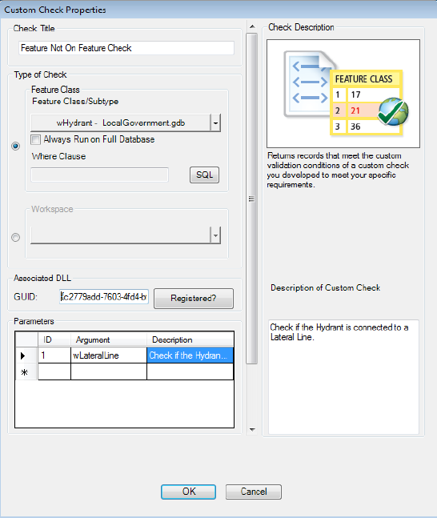

#Data Reviewer Custom Check Samples
##FeatureNotOnFeature

This sample demonstrates how to *....need text here that describes this custom check at a high level*

```
Language:               C#
Subject:                Data Reviewer Custom Check Sample
Contributor:            ArcGIS Data Reviewer Team <DataReviewer_Team@esri.com>
Organization:           Esri, http://www.esri.com
Date:                   04/14/16
ArcGIS Data Reviewer:   10.4
Visual Studio:          2013
```
#How to use the sample
In this section, you will configure and run the FeatureNotOnFeature custom check by using the _Custom Check_ option on the __Data Reviewer__ toolbar.

1. Download and unzip the .zip file or clone the repository.
2. Open Visual Studio and compile the CustomCheckFeatureNotOnFeature solution.
3. Run the command prompt as an administrator. If you are planning to run this custom check in ArcMap then navigate to C:\Windows\Microsoft.NET\Framework\v4.0.30319 folder or else if you are planning to run this custom check in ArcGIS Server then navigate to C:\Windows\Microsoft.NET\Framework64\v4.0.30319 folder.
4. Enter the command _RegAsm.exe <path to your .dll> /codebase_.
5. After the .dll is registered, open ArcMap.
6. Check the __Data Reviewer__ extension check box from __Customize > Extensions__.
7. Add the __Data Reviewer__ toolbar from __Customize > Toolbars__.
8. Click the __Select Data Check__ drop-down on the __Data Reviewer__ toolbar, expand __Advanced Checks__ and click __Custom Check__.
9. Enter _Feature Not On Feature Check_ as the check name in the __Check Title__ text box.
10. Click the __Type of Check__ drop-down and choose the _Input Feature class_ which contains the field which needs to be validated.
11. Enter the GUID for the DLL associated with the custom check in the __GUID__ text box.
    ```Note: The GUID of the CSharp FeatureNotOnFeature custome check is {c2779add-7603-4fd4-bf68-4e5e3021a67c}.```
    
12. Enter an argument in the __Argument__ cell.

    Tip: The FeatureNotOnFeature custom check uses 7 arguments. Only the first 2 are required.  The arguments are as follows: 
    * Target feature class
    * Target subtype (Use '*' to mean all subtypes or just the numeric value of a particular subtype)
    * Numeric value of the spatial operation (1 is the default). See Spatial Relationship Table at the end of this section.
    * The where clause to be applied to target feature class
    * The where clause to be applied to source feature class
    * The spatial relationship string if the third argument is a 9 - esriSpatialRelRelation
    * The message to be associated with each validation result

13. If necessary, enter descriptive text for the check results in the __Notes__ text box in the _Reviewer Remarks_ area.
14. If necessary, click the __Severity__ drop-down and choose a value that indicates the priority of the checks results in the _Reviewer Remarks_ area.
15. If necessary, enter a description of what the check is validating in the __Description of Custom Check__ text box.

    ```Note: The Description of Custom Check is used to describe the custom check. This will be preserved if this check is configured inside a batch job and will not be used while writing results to Data Reviewer.```
    
    
    
16. Click __OK__.
17. Click the __Run__ button on the __Data Reviewer__ toolbar.

