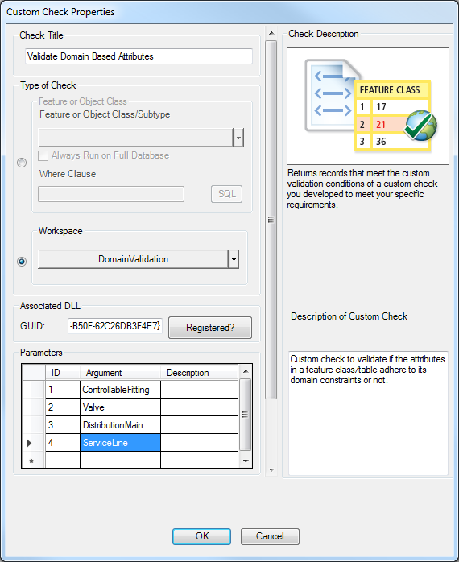

#Data Reviewer Custom Check Samples
##Validate Domain Based Attributes

This sample demonstrate how to use IPLTSCNTWorkspaceValExtension interface for building Data Reviewer Custom check.

```
Language:               C#
Subject:                Data Reviewer Custom Check Sample
Contributor:            ArcGIS Data Reviewer Team <DataReviewer_Team@esri.com>
Organization:           Esri, http://www.esri.com
Date:                   02/09/2016
ArcGIS Data Reviewer:   10.4
Visual Studio: 2013
```
#How to use the sample
In this section, you will configure and run the ValidateDomainBasedAttributes custom check by using the Custom Check option on the Data Reviewer toolbar. You can use any workspace in which you need to validate if the attributes in a feature class/table adhere to its domain constraints or not. Attribute field domains can be either coded values or ranges. The value entered for a field, especially if it is a range, can be outside the valid values. This is especially true if no validation has been performed during attribute editing. In addition, if data has been loaded from an external source, features may exist that violate both range and coded value domains. For instance, while your elevation attribute requires values that are between 0 and 4000, some of the data that has been imported can contain features with elevation values that are not within that range. You can use this custom check to find if there are attributes that are outside the domain values.

1. Download and unzip the .zip file or clone the repository.
2. Open Visual Studio 2013 and compile the CustomCheckValidateDomainBasedAttributes solution.
3. Run the command prompt as an administrator. If you are planning to run this custom check in ArcMap then navigate to C:\Windows\Microsoft.NET\Framework\v4.0.30319 folder or else if you are planning to run this custom check in ArcGIS Server then navigate to C:\Windows\Microsoft.NET\Framework64\v4.0.30319 folder.
4. Enter the command RegAsm.exe <path to your .dll> /codebase
5. After the .dll is registered, open ArcMap.
6. Check the Data Reviewer extension check box from Customize > Extensions.
7. Add the Data Reviewer toolbar from Customize > Toolbars.
8. Click the Select Data Check drop-down on the Data Reviewer toolbar, expand Advanced Checks and click Custom Check.
9. Enter ValidateDomainBasedAttributes Check as the check name in the Check Title text box.
10. Type of check select Workspace option and choose the input workspace for which the attributes in a feature classes/table need to be validated for domain constraints.
11. Enter the GUID for the DLL associated with the custom check in the GUID text box.
```
Note: The GUID of the ValidateDomainBasedAttributes custom check is {10F6A0EB-5415-4837-B50F-62C26DB3F4E7}.
```

12. Type an argument in the Argument cell.
```
Note: For ValidateDomainBasedAttributes, enter the feature class/table names for which the attributes need to be validated for domain constraints.
```

13. If necessary, enter descriptive text for the check results in the Notes text box in the Reviewer Remarks area.
14. If necessary, click the Severity drop-down and choose a value that indicates the priority of the checks results in the Reviewer Remarks area.
15. If necessary, enter a description of what the check is validating in the Description of Custom Check text box.
```
Note: The Description of Custom Check is used to describe the custom check. This will be preserved if this check is configured inside a batch job and will not be used while writing results to Data Reviewer.
```


16. Click OK.
17. Click the Run button on Data Reviewer toolbar.
18. For running this check in ArcGIS Data Reviewer for server configure and save this check in batch job using [Batch Job Manager](http://desktop.arcgis.com/en/arcmap/latest/extensions/data-reviewer/working-with-batch-jobs-in-data-reviewer.htm)
19. Use [ArcGIS Data Reviewer API for JavaScript](https://developers.arcgis.com/javascript/jssamples/datareviewer_executebatchjob.html) to execute the batch job in Server.
